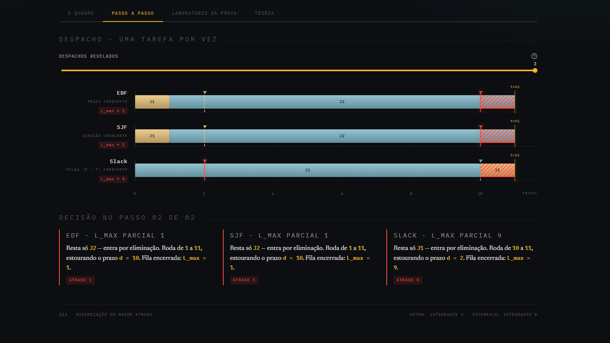
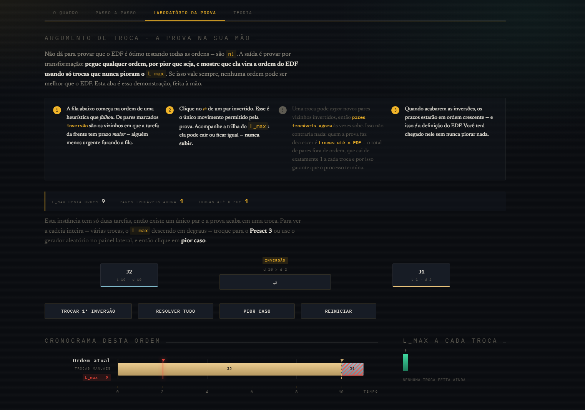

# Quadro de Despachos

Número da Lista: 23<br>
Conteúdo da Disciplina: Greedy (Algoritmos Gulosos)<br>

## Alunos

|Matrícula | Aluno |
| -- | -- |
| 242004671 | Gabriel Ferreira |
| 242028735 | Luiz Henrique Tomaz Moreira |

## Sobre

O Quadro de Despachos é uma aplicação gráfica educativa em Python/Streamlit que compara três estratégias gulosas para o **escalonamento de tarefas em uma única máquina, sem preempção, minimizando o maior atraso (L_max)**. O usuário escolhe uma instância (preset, aleatória ou manual) e acompanha, lado a lado, como cada estratégia decide a ordem de despacho e o que isso custa em atraso.

O objetivo é mostrar que, embora as três estratégias tenham o mesmo custo computacional, apenas o **critério de ordenação** separa a solução ótima das heurísticas que falham. Uma tarefa curta pode "furar a fila" de uma tarefa longa com prazo apertado — e só uma das três ordens garante nunca perder para nenhuma outra.

O projeto possui **três estratégias**:

- **EDF (Earliest Deadline First):** ordena por prazo (`d`) crescente. É a única estratégia **ótima** — minimiza L_max para qualquer instância, com prova formal por *exchange argument*.
- **SJF (Shortest Job First):** ordena por duração (`t`) crescente. Falha quando uma tarefa curta de prazo frouxo passa na frente de uma tarefa longa de prazo apertado.
- **Smallest Slack Time:** ordena por folga (`d - t`) crescente. Falha quando uma folga zero bloqueia a execução de uma tarefa curta que ainda cumpriria o prazo.

Além da comparação direta, a aplicação conta a história em quatro abas:

- **O quadro:** as três ordens lado a lado, num cronograma visual (Gantt desenhado em HTML/CSS), com a tabela da instância.
- **Passo a passo:** revela o despacho tarefa por tarefa, narrando qual critério cada estratégia consultou e o que aconteceu com o prazo.
- **Laboratório da prova:** um laboratório interativo do *exchange argument* — o usuário parte da ordem da pior heurística e troca pares adjacentes invertidos à mão, vendo o L_max nunca piorar até chegar à ordem do EDF.
- **Teoria:** o enunciado formal do problema, o teorema de otimalidade do EDF e a prova por troca de inversões, em tipografia de artigo.

### Modelagem do problema

Cada tarefa é agendada em uma máquina única, sem preempção, começando em `s = 0` e sem tempo ocioso entre tarefas. Toda tarefa `i` tem:

| Símbolo | Significado |
|---|---|
| `t_i` | duração (tempo de processamento) |
| `d_i` | prazo (deadline) |
| `f_i = s_i + t_i` | instante de término |
| `L_i = max(0, f_i - d_i)` | atraso da tarefa |
| `L_max = max_i L_i` | atraso máximo do cronograma — é isso que se minimiza |

Como não há ociosidade, toda ordem termina no mesmo instante (`Σ t_i`); a ordem não decide **quando** o trabalho acaba, decide **quem paga o atraso**. As três estratégias ordenam as tarefas por uma chave diferente e despacham sequencialmente — `O(n log n)` para ordenar, `O(n)` para o despacho.

## Screenshots

<table>
  <tr>
    <td align="center"><br>O quadro</td>
    <td align="center"><br>Placar comparativo</td>
  </tr>
  <tr>
    <td align="center"><br>Passo a passo</td>
    <td align="center"><br>Laboratório da prova</td>
  </tr>
  <tr>
    <td align="center"><br>Teoria</td>
    <td align="center"><br>Painel de controle</td>
  </tr>
</table>

> As imagens acima ainda não existem em `assets/screenshots/`. Rode a aplicação (veja [Instalação](#instalação)) e capture cada aba com esses nomes de arquivo.

## Instalação

Linguagem: Python 3.10 ou superior<br>
Framework: [Streamlit](https://streamlit.io/), declarado com `pandas` em [requirements.txt](requirements.txt)<br>

Pré-requisitos: um navegador para abrir a interface do Streamlit (a aplicação roda num servidor local e abre automaticamente no navegador padrão).

Clone o projeto e entre na pasta:

```bash
git clone https://github.com/projeto-de-algoritmos-2026/G23_Greedy_PA-26.2.git
cd G23_Greedy_PA-26.2
```

### Windows — PowerShell

```powershell
py -3 -m venv .venv
.\.venv\Scripts\python.exe -m pip install -r requirements.txt
.\.venv\Scripts\python.exe -m streamlit run src/app.py
```

### Linux e macOS

```bash
python3 -m venv .venv
.venv/bin/python -m pip install -r requirements.txt
.venv/bin/python -m streamlit run src/app.py
```

Execute a partir da raiz do projeto, para que o Streamlit encontre `src/app.py` e os módulos em `src/` se importem corretamente entre si.

## Uso

1. Abra a aplicação: ela sobe num servidor local e abre no navegador em `http://localhost:8501`.
2. No painel lateral, escolha a origem das tarefas: **Preset** (instâncias que expõem a falha de cada heurística), **Aleatório** (gerador com semente reprodutível) ou **Manual** (tabela editável).
3. Veja o placar comparativo no topo: o L_max de cada estratégia, com a ótima destacada e a degradação das demais em relação a ela.
4. Navegue pelas quatro abas — **O quadro**, **Passo a passo**, **Laboratório da prova** e **Teoria** — para explorar o cronograma, a narração do despacho, a prova interativa por troca de inversões e a fundamentação formal.
5. No **Laboratório da prova**, clique nos botões ⇄ para trocar pares adjacentes invertidos (ou use **resolver tudo**) e observe o L_max nunca piorar até a sequência coincidir com a ordem do EDF.

### Presets disponíveis

| Preset | Instância | O que demonstra |
|---|---|---|
| Preset 1 — Quebra do SJF | `J1(t=1,d=100)`, `J2(t=10,d=10)` | EDF chega a `L_max=0`; SJF roda `J1` primeiro e atrasa `J2` |
| Preset 2 — Quebra do Smallest Slack | `J1(t=1,d=2)`, `J2(t=10,d=10)` | Slack roda a tarefa de folga zero primeiro e atrasa a tarefa curta |
| Preset 3 — Cenário ideal | `J1(t=2,d=5)`, `J2(t=3,d=10)`, `J3(t=4,d=20)` | Todas as tarefas cumprem o prazo, independente da ordem |

### Métricas do placar

| Métrica | Significado na implementação |
|---|---|
| L_max | Maior atraso entre todas as tarefas da ordem avaliada — é o que o placar ordena e destaca |
| Delta sobre o ótimo | Diferença entre o L_max da estratégia e o L_max da melhor estratégia na mesma instância |
| % pior | Delta sobre o ótimo expresso como percentual do L_max ótimo (quando o ótimo é maior que zero) |

> O makespan (instante em que a última tarefa termina) é o mesmo para qualquer ordem, já que não há ociosidade. A ordem não muda quando o trabalho acaba — só decide quem fura o prazo.

## Outros

### Prova de otimalidade do EDF (exchange argument)

| Passo | Ideia |
|---|---|
| 1 | Uma **inversão** é um par de tarefas vizinhas em que a da frente tem prazo maior que a de trás (`d_i > d_j`) |
| 2 | O cronograma do EDF não tem inversões, por construção (ordena por prazo crescente) |
| 3 | Todo cronograma com alguma inversão tem pelo menos um **par adjacente invertido** |
| 4 | Trocar esse par não afeta nenhuma outra tarefa — a soma das durações do par é a mesma |
| 5 | A tarefa que passa a rodar primeiro termina mais cedo: seu atraso não aumenta |
| 6 | A tarefa que passa a rodar depois termina onde a outra terminava antes; como seu prazo era maior, seu atraso pós-troca é no máximo o atraso anterior da outra |
| 7 | Logo, a troca nunca aumenta o L_max do cronograma inteiro |
| 8 | Cada troca reduz em exatamente 1 o total de pares fora de ordem — um valor finito — então o processo termina. Repetindo-o, qualquer ordem vira a ordem do EDF sem nunca piorar L_max: **o EDF é ótimo** |

Essa prova é o que o **Laboratório da prova** (aba da aplicação) deixa o usuário executar manualmente, troca por troca.

### Estrutura do projeto

```text
G23_Greedy_PA-26.2/
├── README.md
├── requirements.txt           # Dependências (streamlit, pandas)
├── .streamlit/config.toml     # Tema escuro nativo do Streamlit
└── src/
    ├── app.py                 # Ponto de entrada: monta a página e as quatro abas
    ├── engine.py               # Adapter: ponto único de acesso ao motor (presets, gerador, despacho)
    ├── models.py                # Contrato de dados: Job, ScheduledJob, ScheduleResult
    ├── scheduler.py             # Motor algorítmico: run_edf, run_sjf, run_slack
    ├── presets.py                # Instâncias fixas que provam a falha de cada heurística
    ├── generator.py              # Gerador de instâncias aleatórias (semente reprodutível)
    ├── mock_data.py               # Fallback usado só se os módulos reais não existirem
    ├── insights.py                # Leituras derivadas de um ScheduleResult (metadados, resumos)
    ├── theme.py                    # Design system "Quadro de Despachos" (CSS injetado)
    ├── test_scheduler.py           # Testes unitários do motor e dos presets
    ├── components/
    │   ├── sidebar.py               # Painel de controle: preset, gerador ou tabela manual
    │   ├── metrics.py                # Placar comparativo com o L_max de cada estratégia
    │   ├── stepper.py                 # Despacho passo a passo, com a decisão narrada
    │   ├── exchange.py                 # Laboratório interativo do exchange argument
    │   └── theory.py                    # Enunciado, teorema e prova em tipografia de artigo
    └── viz/
        └── gantt.py                     # Cronograma (Gantt) desenhado em HTML/CSS
```
